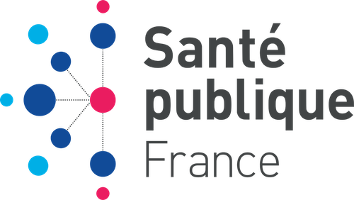

# Santé Publique France


L'agence "Santé publique France" a lancé un appel à projets pour rendre les données de santé plus accessibles. Elle souhaite faire explorer et visualiser des données, pour que ses agents puissent les exploiter.


# Installation avec conda
## Création de l'environnement virtuel
```
conda env create -f environment.yml
```

### Ajouter l'environnement dans Jupyter Notebook

```
python -m ipykernel install --user --name=venv
```

### Lancer Jupyter Notebook

```
jupyter notebook
```